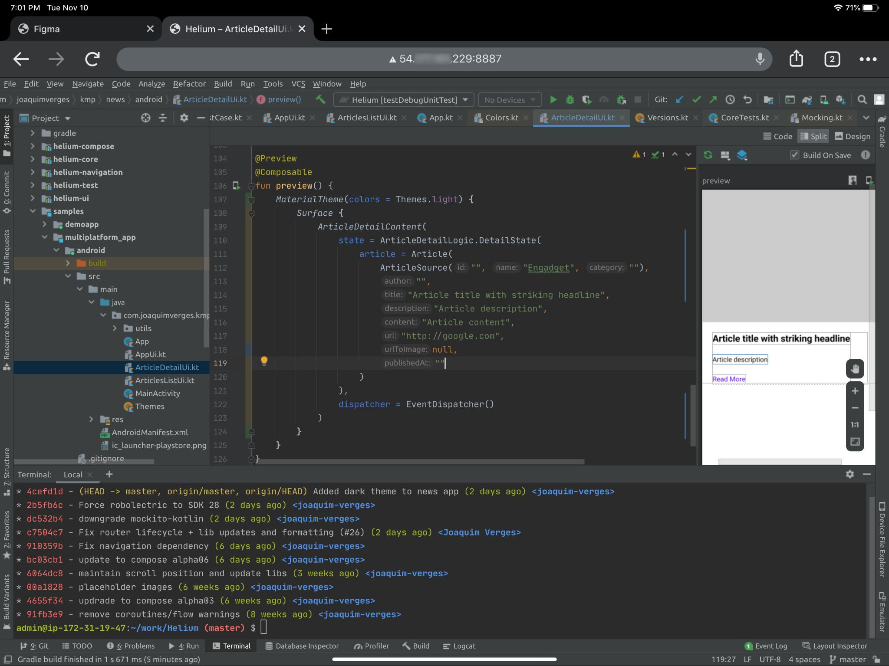

# JetBrains Projector with Android Studio

Guide to setup JetBrains Projector and access Android Studio from any device.


*Android Studio on an iPad Pro*

### Step 1: Spin up a Linux server

This guide will explain how to get a virtual machine setup with Amazon AWS, but you can choose any other provider like Google Cloud or Microsoft Azure, or even a machine on your local network.

1. Make a [AWS account](https://aws.amazon.com/free/) and login
2. Go to the EC2 section and select create a new Instance
3. Search for "Debian" in the AWS Marketplace and choose the latest Debian distribution (Debian 10 Buster at the time of writing)
4. Pick the instance type, I suggest one with at least 8Gb RAM, preferrably more
5. Click next until you get to storage, and choose how much storage you need. I suggest at least 20Gb (you can always expand this later)
6. Click next until the security section, you need to add a new rule to be able to access the port that Projector will use
* Add a new custom TCP rule with port 8888 (or any port you like, will be useful in the next step)
* If you want to secure access, you can choose to only allow connections only from your own IP adress (recommended): Source > My Ip
7. Choose or create a private key to access the instance and start it
8. Write down the IP addresss (ipv4) shown in the EC2 console

### Step 2: Connect to your remote server via SSH

1. To make it easy to connect to your instance, create a new file ~/.ssh/config (if it doesn't exist already)
2. Add a new host to your ~/.ssh/config:
```
Host {REMOTE_MACHINE_ALIAS}
  User {REMOTE_MACHINE_USERNAME}
  HostName {REMOTE_MACHINE_IP_OR_HOSTNAME}
  Port 22
  IdentityFile ~/.ssh/{SSH_KEY_NAME}
  PreferredAuthentications publickey
  ControlMaster auto
  ControlPath /tmp/%r@%h:%p
  ControlPersist 1h
```
* `Host` - Choose an alias like `remote-builder` or anything you like
* `User` - By default, the username for a Debian server is `admin`
* `Hostname` - the IP address of your EC2 instance
* `IdentityFile` - the path to your private key file downloaded when creating the EC2 instance

3. Now you can connect to your machine easily like this

```
$ ssh remote-builder
```
4. Once connected, you can now begin installing things on your remote server

### Step 2: Install Projector and Android Studio on the remote server

1. To install Projector (and dependencies), run the following commands:
```
$ sudo apt install python3 python3-pip
$ sudo apt install libxext6 libxrender1 libxtst6 libfreetype6 libxi6
$ pip3 install projector-installer
```
2. Projector is now installed, you can see all options by running 
```
projector --help
```
3. At this point, you could run one of the pre-configured IDEs like IntelliJ and start using it, but to run Android Studio, you need to install it separately.
4. Download the latest Android Studio 4.2 or above (4.2 is the minimum version that works with Projector)
* Find the latest download URL for linux from https://developer.android.com/studio/archive. At the time of writing, the latest version is 4.2 Canary 16
* Download it to your remote server in your home directory with curl: 

```
$ curl --output android-studio.tar.gz https://redirector.gvt1.com/edgedl/android/studio/ide-zips/4.2.0.16/android-studio-ide-202.6939830-linux.tar.gz
```
* Unzip the downloaded archive:

```
$ tar -xvf android-studio.tar.gz
```
5. You now have Android Studio installed, all that is left is to configure Projector, making sure to select the port that was chosen as the custom TCP rule for the VM (step 1.6) - here we're using port 8888
```
$ projector config add
Enter a new configuration name: AndroidStudio
Do you want to choose a Projector-installed IDE? [y/n]: n
Enter the path to IDE: /path/to/your/android-studio
Enter a desired Projector port (press ENTER for default) [10005]: 8888
```
6. This will start Android Studio with Projector on port 8888. Next time you want to start it, you can just run:

```
$ projector run AndroidStudio
```

### Step 3: Access Android Studio from a Browser

1. On your local machine, start a browser and go to `http://<your_server_ip>:8888`
2. Click OK on the dialog that shows up
3. Enjoy your remote Android Studio!

### Optional: Setup ADB to deploy to / debug a local device

1. You need to have the same version of adb on the remote and local machine
```
$ adb -- version
Android Debug Bridge version 1.0.41
Version 30.0.4-6686687
```
2. Kill adb on both local and remote machines if it was already running
```
$ adb kill-server
```
3. On the local machine, with an Android device connected, run:
```
$ adb devices
List of devices attached
  ABCDEF12345
$ ssh -R 5037:localhost:5037 remote-builder
```
4. This will connect to your instance with port forwarding enabled. Now check that the device is visible on the remote machine:
```
$ adb devices
List of devices attached
  ABCDEF12345
```
5. That's it! Both machines can now run adb commands and everything will be redirected to the local phone.
6. To always connect to your instance with adb port forwarding (port 5037 by default), you can add the following line to your `~/.ssh/confg`:
```
RemoteForward 5037 localhost:5037
```


### Useful links and other installation methods

[Main Projector README](https://github.com/JetBrains/projector-server/blob/master/README-JETBRAINS.md)

[Projector Docker Image](https://github.com/JetBrains/projector-docker)

[Projector Installer Repo](https://github.com/JetBrains/projector-installer)

[Projecter Server Repo](https://github.com/JetBrains/projector-server/blob/master/docs/Projector.md)

